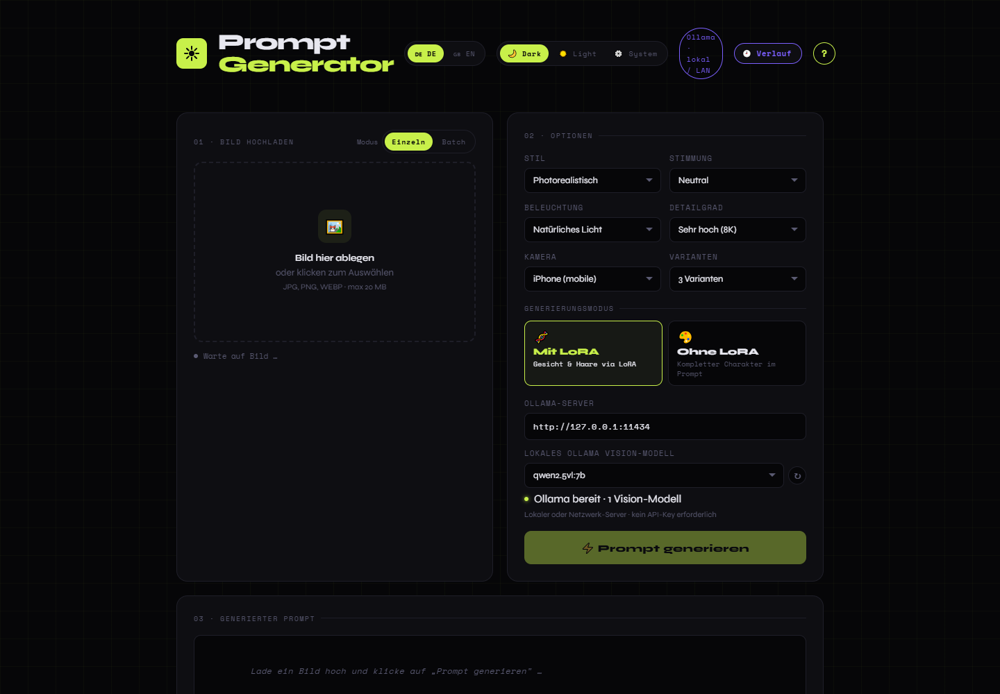
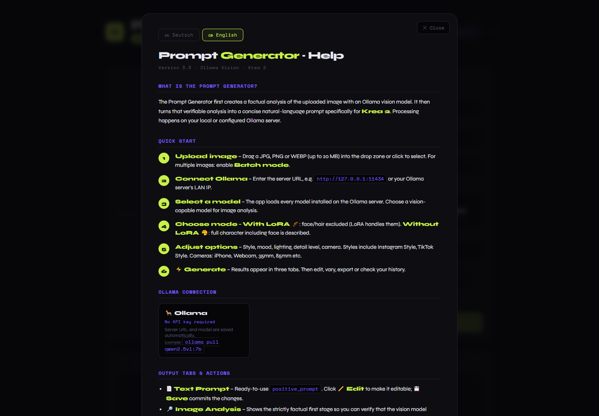

# Prompt Generator Ollama

[](https://github.com/Twilight1971/prompt-generator-ollama/releases/latest)
[](https://github.com/Twilight1971/prompt-generator-ollama/releases/latest)
[](https://ollama.com/)
[](LICENSE)

Desktop-App für Windows, die Bilder mit einem lokalen oder im LAN erreichbaren Ollama-Vision-Modell analysiert und daraus bildgetreue Prompts für Krea 2 erstellt. Kein API-Key erforderlich.

[Deutsch](#deutsch) · [English](#english)



---

## Deutsch

### Funktionen

- Installierte Ollama-Modelle automatisch laden und auf Vision-Fähigkeit prüfen
- Ollama lokal oder über eine frei einstellbare Server-IP im Netzwerk verwenden
- Zweistufige Verarbeitung: faktische Bildanalyse, danach kompakter Krea-2-Prompt
- Einzelbild- und Batch-Verarbeitung mit ZIP-Export
- Modi **Mit LoRA** und **Ohne LoRA**
- Stil, Stimmung, Beleuchtung, Detailgrad, Kamera und Anzahl der Varianten wählen
- 11 Prompt-Variationen, darunter **iPhone Selfie**: Amateur-Selfie aus Armlänge, ohne sichtbares Smartphone
- Bildanalyse, Text-Prompt und strukturiertes JSON getrennt anzeigen
- Negative Prompts bearbeiten sowie für Automatic1111, ComfyUI und FLUX/Fooocus exportieren
- Verlauf der letzten 20 Prompts, Dark/Light/System-Theme und Deutsch/Englisch

### Download und Start

1. Öffne die [neueste GitHub-Version](https://github.com/Twilight1971/prompt-generator-ollama/releases/latest).
2. Lade die portable `.exe` oder die `.zip` herunter.
3. Bei der ZIP-Datei: zuerst vollständig entpacken, dann die EXE starten.
4. Falls Windows SmartScreen erscheint, wähle **Weitere Informationen → Trotzdem ausführen**. Die App ist derzeit nicht kommerziell codesigniert.

Ollama und die Modelle sind nicht in der EXE enthalten. Sie müssen auf deinem PC oder einem erreichbaren Rechner im Netzwerk laufen.

### Ollama vorbereiten

Installiere zuerst [Ollama](https://ollama.com/download) und lade mindestens ein Vision-Modell, zum Beispiel:

```powershell
ollama pull qwen2.5vl:7b
ollama serve
```

Welche Modelle angezeigt werden, hängt von deinem Ollama-Server ab. Reine Textmodelle werden ausgeblendet, weil sie das hochgeladene Bild nicht analysieren können.

### Schnellstart

1. Trage unter **Ollama-Server** die Adresse ein:
   - gleicher PC: `http://127.0.0.1:11434`
   - Netzwerkserver: zum Beispiel `http://192.168.1.50:11434`
2. Klicke auf **↻**, falls die Modellliste nicht automatisch aktualisiert wird.
3. Wähle ein installiertes Vision-Modell aus.
4. Lade ein JPG-, PNG- oder WEBP-Bild bis 20 MB hoch.
5. Wähle **Mit LoRA**, wenn Gesicht und Haare später durch eine LoRA erzeugt werden. Wähle **Ohne LoRA**, wenn der gesamte Charakter beschrieben werden soll.
6. Stelle Stil, Stimmung, Beleuchtung, Kamera und Varianten ein.
7. Klicke auf **Prompt generieren**.

Die App sendet zwei Anfragen an Ollama: Zuerst wird das Bild möglichst sachlich beschrieben. Anschließend formuliert das Modell aus dieser Analyse den Krea-2-Prompt. Dadurch bleibt die Ausgabe enger am hochgeladenen Bild.

### Ergebnis verwenden

- **Text Prompt** enthält den fertigen Prompt für Krea 2.
- **Bildanalyse** zeigt, was das Vision-Modell im Bild erkannt hat. Prüfe diesen Tab zuerst, wenn der Prompt nicht zum Bild passt.
- **Strukturiertes JSON** enthält Prompt, Analyse und Fidelity-Hinweise.
- **Prompt-Variationen** verändern den vorhandenen Prompt, ohne das Bild erneut hochzuladen.
- **iPhone Selfie** erzeugt einen bewusst unperfekten POV-Selfie-Look aus Armlänge mit natürlicher Smartphone-Optik, ohne ein Telefon im Bild zu zeigen.
- **ComfyUI / A1111** formatiert Positive und Negative Prompts für weitere Workflows.

### Batch-Modus

Schalte im Upload-Bereich auf **Batch**, füge mehrere Bilder hinzu und starte die Generierung. Die Bilder werden nacheinander verarbeitet. Am Ende erstellt die App eine ZIP-Datei mit einer `.txt`- und `.json`-Datei pro Bild.

### Fehlerhilfe

| Problem | Lösung |
| --- | --- |
| **Ollama ist nicht erreichbar** | Prüfe, ob `ollama serve` läuft, die Adresse mit `http://` beginnt und Port `11434` erreichbar ist. Bei einem LAN-Server müssen Ollama und die Windows-Firewall Verbindungen aus deinem Netzwerk zulassen. |
| **Kein Vision-Modell installiert** | Installiere ein bildfähiges Modell mit `ollama pull <modell>` und klicke danach auf **↻**. Textmodelle erscheinen absichtlich nicht. |
| **Ein installiertes Modell fehlt in der Liste** | Aktualisiere die Liste. Wird es weiterhin nicht angezeigt, meldet Ollama für dieses Modell keine `vision`-Fähigkeit. |
| **Der Prompt passt nicht zum Bild** | Öffne den Tab **Bildanalyse**. Ist schon die Analyse falsch oder allgemein, nutze ein stärkeres Vision-Modell und ein klareres Eingabebild. Optionen und Variationen werden erst auf Basis dieser Analyse angewendet. |
| **Verschiedene Modelle liefern fast dasselbe Ergebnis** | Prüfe, ob sich das ausgewählte Modell wirklich geändert hat und ob die Bildanalyse unterschiedlich ist. Krea-2-Regeln und gewählte Optionen bleiben bewusst konstant, die Bilddetails müssen aber aus der Analyse stammen. |
| **Die Generierung dauert lange** | Jeder Prompt benötigt zwei Modellaufrufe. Der erste Start eines Modells dauert zusätzlich, weil Ollama es in den Speicher lädt. Kleinere Vision-Modelle sind schneller. |
| **LAN-Server funktioniert nur auf dem Server-PC** | Prüfe Ollamas Bind-Adresse und die Firewall-Regel für TCP-Port `11434`. Verwende in der App die tatsächliche LAN-IP statt `127.0.0.1`. |
| **Windows warnt beim Start** | Die portable EXE ist noch nicht codesigniert. Lade sie nur von der offiziellen Release-Seite und vergleiche bei Bedarf den Hash mit `SHA256SUMS.txt`. |

### Datenschutz

Bilder und Texte werden ausschließlich an die in der App eingetragene Ollama-Adresse gesendet. Serveradresse, Modell, Verlauf, Sprache und Theme werden lokal auf deinem Windows-PC gespeichert. Die App benötigt keinen Cloud-API-Key.

### Entwicklung und eigener Build

Voraussetzungen: Node.js 20 oder neuer und npm.

```powershell
git clone https://github.com/Twilight1971/prompt-generator-ollama.git
cd prompt-generator-ollama
npm install
npm start
npm run dist
```

Die portable EXE wird in `dist/` erzeugt.

---

## English

Prompt Generator Ollama is a portable Windows desktop app that analyzes images with an Ollama vision model running locally or on your LAN, then creates image-faithful prompts optimized for Krea 2. No API key is required.



### Features

- Discover installed Ollama models and show vision-capable models only
- Connect to Ollama on the same PC or enter a server IP on your network
- Two-stage workflow: factual image analysis followed by a concise Krea 2 prompt
- Single-image and batch processing with ZIP export
- **With LoRA** and **Without LoRA** generation modes
- Controls for style, mood, lighting, detail level, camera and variation count
- 11 prompt variations, including an arm's-length amateur **iPhone Selfie** without a visible phone
- Separate text prompt, image analysis and structured JSON views
- Editable negative prompts and exports for Automatic1111, ComfyUI and FLUX/Fooocus
- Prompt history, dark/light/system themes and German/English UI

### Download and launch

1. Open the [latest GitHub release](https://github.com/Twilight1971/prompt-generator-ollama/releases/latest).
2. Download either the portable `.exe` or the `.zip` archive.
3. If you downloaded the ZIP, extract it completely before launching the EXE.
4. Windows SmartScreen may show an unknown-publisher warning because the app is not commercially code-signed yet.

Ollama and its models are not bundled with the application. Ollama must be running on your PC or on a reachable machine in your network.

### Prepare Ollama

Install [Ollama](https://ollama.com/download), then pull at least one vision model:

```powershell
ollama pull qwen2.5vl:7b
ollama serve
```

The model picker reflects the models installed on your own server. Text-only models are hidden because they cannot inspect the uploaded image.

### Quick start

1. Enter the **Ollama server** URL:
   - same PC: `http://127.0.0.1:11434`
   - network server: for example `http://192.168.1.50:11434`
2. Click **↻** if the model list does not refresh automatically.
3. Select an installed vision model.
4. Upload a JPG, PNG or WEBP image up to 20 MB.
5. Select **With LoRA** when a LoRA should provide face and hair. Select **Without LoRA** for a complete character description.
6. Adjust style, mood, lighting, camera and variation count.
7. Click **Generate prompt**.

The app sends two requests to Ollama. The first creates a factual description of the image; the second turns that analysis into a Krea 2 prompt. This keeps the final prompt grounded in the uploaded image.

### Working with the result

- **Text Prompt** contains the ready-to-use Krea 2 prompt.
- **Image Analysis** shows what the vision model actually recognized. Check this tab first when the result does not match the source image.
- **Structured JSON** contains the prompt, analysis and fidelity notes.
- **Prompt Variations** modify the existing prompt without another upload.
- **iPhone Selfie** produces an intentionally imperfect, arm's-length POV selfie with natural smartphone characteristics and no phone visible in the image.
- **ComfyUI / A1111** formats positive and negative prompts for downstream workflows.

### Batch mode

Switch the upload panel to **Batch**, add multiple images and start generation. Images are processed sequentially. The app then downloads a ZIP archive containing one `.txt` and one `.json` file per image.

### Troubleshooting

| Problem | Fix |
| --- | --- |
| **Ollama is not reachable** | Make sure `ollama serve` is running, the URL starts with `http://`, and port `11434` is reachable. A LAN server must allow network access in Ollama and the Windows firewall. |
| **No vision model installed** | Pull a vision-capable model with `ollama pull <model>`, then click **↻**. Text-only models are intentionally hidden. |
| **An installed model is missing** | Refresh the list. If it remains hidden, Ollama does not report the `vision` capability for that model. |
| **The prompt does not match the image** | Open **Image Analysis**. If that analysis is already incorrect or generic, use a stronger vision model and a clearer source image. |
| **Different models produce nearly identical prompts** | Confirm that the selected model changed and compare their image analyses. Krea 2 rules and selected controls intentionally stay consistent, while image-specific details must come from the analysis. |
| **Generation is slow** | Each result uses two model calls. The initial run also takes longer while Ollama loads the model into memory. Smaller vision models are faster. |
| **The LAN server works only on its own PC** | Check Ollama's bind address and the firewall rule for TCP port `11434`. Enter the server's LAN IP instead of `127.0.0.1`. |
| **Windows warns during launch** | The portable EXE is not code-signed yet. Download it only from the official release and optionally verify it against `SHA256SUMS.txt`. |

### Privacy

Images and text are sent only to the Ollama address configured in the app. Server URL, model selection, history, language and theme remain stored locally on your Windows PC. No cloud API key is required.

### Development and build

Requirements: Node.js 20 or newer and npm.

```powershell
git clone https://github.com/Twilight1971/prompt-generator-ollama.git
cd prompt-generator-ollama
npm install
npm start
npm run dist
```

The portable EXE is created in `dist/`.

## Project structure

- `index.html` — user interface and prompt workflow
- `main.js` — Electron window and secure proxy to the configured Ollama API
- `preload.js` — narrow IPC bridge between the UI and Electron main process
- `.github/workflows/release.yml` — Windows release build

The renderer has no direct Node.js access. Ollama requests pass through the isolated Electron main process, so the desktop app does not require browser CORS configuration.

## License

[MIT](LICENSE)
